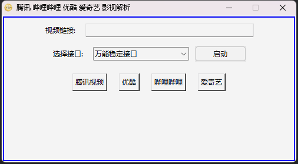

# 🎥 henVIP 视频/电影解析工具  📽️

欢迎使用 VIP 视频解析工具，这是一款支持腾讯视频、优酷、哔哩哔哩、爱奇艺等多平台视频解析的多功能工具。无论是图形界面版本还是命令行版本，我们都能为您提供便捷的解析服务。

## 📋 功能特性

- **图形界面版**：简单易用的图形界面，支持快捷键设置与管理。
- **命令行版**：快速高效的命令行操作，支持多种解析路线。
- **多平台支持**：支持腾讯视频、优酷、哔哩哔哩、爱奇艺等主流视频网站。
- **多种解析线路**：
  - 万能稳定接口：`https://jx.m3u8.tv/jiexi/?url=`
  - 稳定接口：`https://www.yemu.xyz/?url=`
  - 官网：不使用任何解析接口

## 功能演示

**1.0.0版本**




## 📦 EXE 程序使用教程

我们提供了打包好的 EXE 程序，方便用户直接运行，无需配置 Python 环境。

1. 前往[Releases](https://github.com/chenhen666/henVIP/releases)，找到你需要的版本（一般用最新版），在版本介绍处可以看到文件介绍，下载对应的文件。
2. 双击运行 `VIP.exe` 以启动图形界面版本。
3. 使用命令行打开终端，并运行以下命令来使用命令行版本：
   
   ```bash
   vippj -a <视频链接>
   vippj -b <视频链接>
   vippj -c <视频链接>
   ```
   
   注意：请将 `<视频链接>` 替换为实际的视频 URL。

## 🎛️ 使用说明

### 图形界面版

1. 启动程序后，您可以在窗口中输入视频链接，并选择解析线路。
2. 点击 "启动" 按钮，程序将自动打开解析后的链接。
3. 您还可以点击底部的按钮快速访问腾讯视频、优酷、哔哩哔哩、爱奇艺。

### 命令行版

命令行版提供了三种解析线路的选择：

- 使用第一个解析路线：
  
  ```bash
  vippj -a <视频链接>
  ```
- 使用第二个解析路线：
  
  ```bash
  vippj -b <视频链接>
  ```
- 使用第三个解析路线：
  
  ```bash
  vippj -c <视频链接>
  ```

## 🌐 系统要求

- Windows 操作系统（对于 EXE 版本）
- Python 3.6+（对于源代码版本）
- 需要安装 `webbrowser`, `argparse`, `re`, 和 `sys` 等标准库（对于源代码版本）

## 📜 贡献

如果您希望为本项目做出贡献，请遵循以下步骤：

1. Fork 本仓库。
2. 创建一个新的分支。
3. 提交您的更改。
4. 将更改推送到您的分支。
5. 提交一个 Pull Request，等待我们的审核和合并。

## 📜 许可证

本项目使用 [GNU General Public License v3.0](https://www.gnu.org/licenses/gpl-3.0.zh-cn.html) 许可证。您可以自由地使用和修改这个项目，但请遵循许可证的相关规定。

---

感谢您使用 VIP 视频解析工具！如果您有任何问题或建议，请随时联系我们。✨


